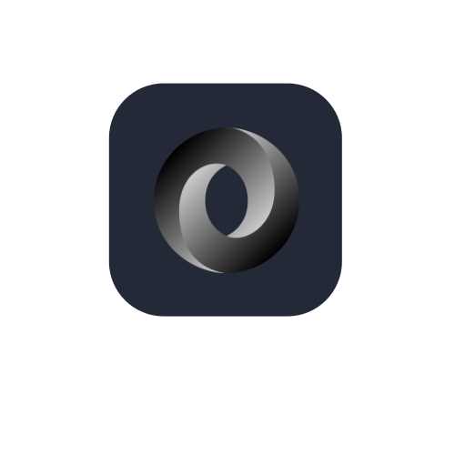

<h1 align="center">

</h1>

         <a href="https://github.com/RedBlaze908?tab=repositories&sort=stargazers">
         
<!----></a>
<!--
  
-->

### About me:

- I am young 😂
- IT and telecommunications 🎓
- Developer - Web Developer - Game Developer - Gamer

- 🔭 I don't currently work
- 🌱 I’m currently studing at an IT University
- ⚡ Fun fact: i like SUSHI! and practical speedcube!
- 🇪🇺 I can speak: Italian, English and a little bit of Japanese and Portuguese

---

### 🖥Languages I use:

         
         
          
         

 
 
 

---
### Programming Languages I Know A Little:

 

---
### 📱Application I use:

 
 
 

---

### 💻 What I worked on:

 <b>Projects</b> 

 
<ul>
 <li> <a href="https://redblaze908.github.io/My-Site/" target="_blank">My Site</a></li>
 <li> <a href="https://redblaze908.github.io/SpeedCubeTrainer/" target="_blank">SpeedCubeTrainer</a></li>
 <li> Blaze Programming Language beta 1.0</li>
 <li> VR Game (Simulation of how to assemble a pc)</li>
 <li> Learn Linux (Game site for learn linux)</li>
 <li> Tetris Clone (C++ | SFML)</li>
 <li> A School CMS (full stack website)</li>
</ul>

---

### ❓What I'm Working on:

My Website V2

SpeedCubeTrainer V2

---

### Abandoned Projects:

 <b>Projects</b> 

 
<ul>
 <li> Blaze Programming Language v1.0 (I was working on a compiled version)</li>
 <li> Blaze Programming Language Site</li>
 <li> Mystic Shadows (video game)</li>
 <li> Chess+ (video game made only with c++)</li>
 <li> Suvival Game 2.5D (c++)</li>
 <li> Survival Game Open World (c++ SFML | Maybe Multiplayer)</li>
 <li> To Do List (App)</li>
 <li>Pac Man Clone In C++ </li>
 <li>ShadowSouls (2D game)</li>
 <li>Learn Linux (status: finished release: ???)</li>
 <li>Japanese Trainer</li>
</ul>

---

### 📫 How to reach me:

  Twitch &middot; <a href="https://www.twitch.tv/redblaze90">RedBlaze90</a>

  Instagram &middot; <a href="https://instagram.com/RedBlaze908">@redblaze908</a>

  Minecraft &middot; RedBlaze908
    

  Youtube &middot; <a href="https://www.youtube.com/@RedBlaze9080">RedBlaze908</a>

  Discord &middot; <a href="https://discord.gg/kJyN47dVgU">My Server Discord</a>

<h2 align="center">⚡ Stats ⚡</h2>
 

  
  
   
         
  <!---->
         
  
  

    
           

  <h2>🐍 My Contributions 🐍</h2>
   
  
  
     

 
